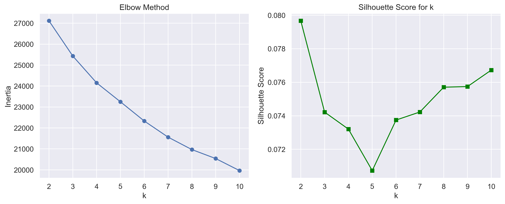
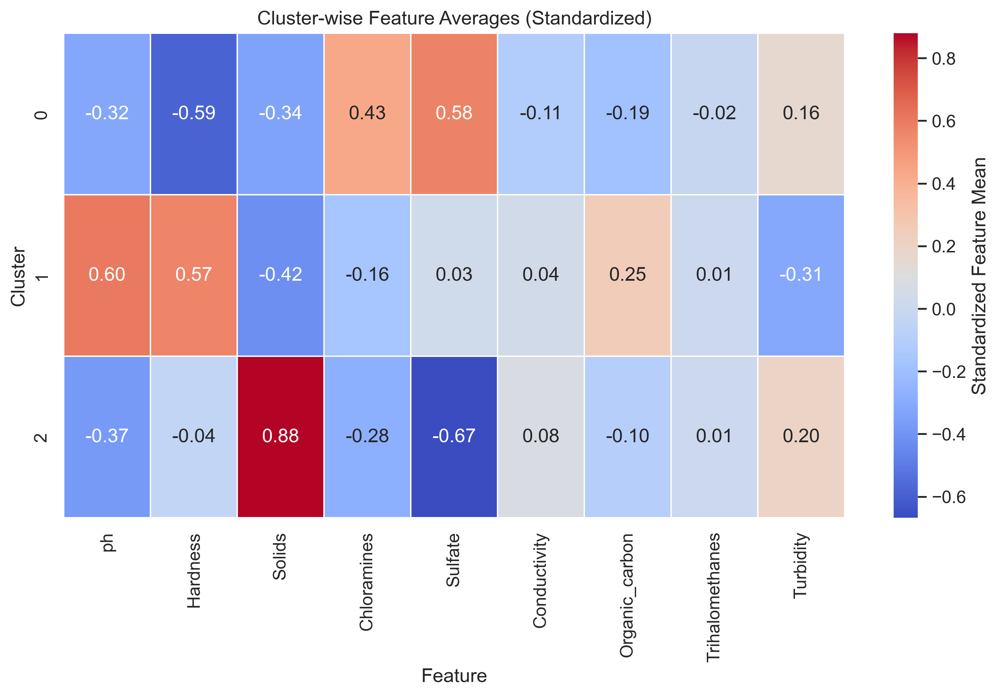
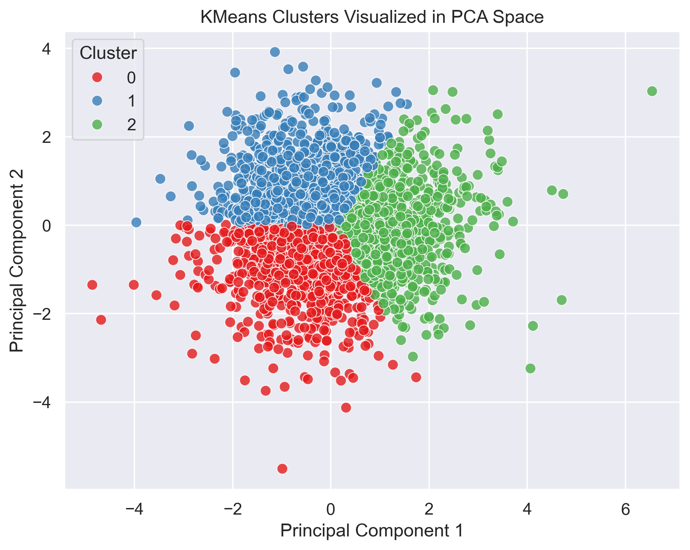

# Water Quality Risk Segmentation using Unsupervised Learning

This project applies **unsupervised machine learning (KMeans clustering)** on a water quality dataset to **segment different types of water samples** based on their chemical properties. Each segment (cluster) is labeled with an interpretable **risk category (Safe / Moderate Risk / Unsafe)** and the reasoning behind it.

> No target labels were used — this is a completely unsupervised approach.
> 
---

## Project Objective

To group water samples into **risk-based categories** using unsupervised ML and analyze what makes water **safe or risky** based on measurable features like `pH`, `Hardness`, `Chloramines`, `Turbidity`, etc.

---

## Dataset Overview

- **Source**: UCI Water Potability Dataset  
- **Total samples**: 3,276  
- **Features**:  
  - `ph`, `Hardness`, `Solids`, `Chloramines`, `Sulfate`, `Conductivity`,  
    `Organic_carbon`, `Trihalomethanes`, `Turbidity`  
- **Dropped column**: `Potability` (since we are doing unsupervised learning)  
- **Missing values** were handled using median imputation for numerical columns.

---

## Steps Performed

### 1. Data Preprocessing

- Dropped the `Potability` column.
- Imputed missing values in `ph`, `Sulfate`, and `Trihalomethanes` using **median**.
- Standardized all features using **StandardScaler** (zero mean, unit variance).

---

### 2. Dimensionality Reduction (PCA)

- Applied **PCA** to reduce the feature space from 9 dimensions to **2 principal components** for visualization purposes.
- This helped visualize clusters in a 2D space after KMeans.

---

### 3. Optimal Cluster Selection

- Used the **Elbow Method** and **Silhouette Scores** to identify the optimal number of clusters.
- Chose **K = 3** based on visual and score-based evaluation.

<div align="center">
  
</div>

---

### 4. KMeans Clustering

- Applied **KMeans clustering** with `n_clusters = 3` on the scaled data.
- Added the predicted cluster labels back into the original dataset.

---

### 5. Cluster Interpretation

- Computed **cluster-wise feature averages** on standardized values.
- Created a heatmap to interpret what makes each cluster different.

<div align="center">
  
</div>

---

### 6. Risk Category Labeling

Mapped each cluster to a **human-interpretable risk category** based on feature trends:

| Cluster | Risk Category  | Interpretation |
|---------|----------------|----------------|
| **0**   | Safe         | Water in this cluster shows low levels of dissolved solids, turbidity, and organic carbon. Chloramines and sulfates are present in moderate levels, indicating stable disinfection and mineral balance. |
| **1**   | Moderate Risk | Water in this cluster tends to be harder with slightly elevated levels of chloramines and trihalomethanes. May cause long-term issues if not monitored, but not acutely unsafe. |
| **2**   | Unsafe        | Water here shows **excessively high levels of dissolved solids**, with **low sulfate and chloramine levels**, indicating possible poor disinfection and contamination. |

---

### 7. Final Output Saved

- The complete labeled dataset was saved as:
  ```
  water_clusters.csv
  ```
  It contains:
  - Original features (standardized)
  - Cluster label
  - Risk label (Safe, Moderate Risk, Unsafe)
  - One-line explanation (`Risk_Reason`) per sample

---

## Visualization of Clusters (PCA View)

<div align="center">
  
</div>

---

## Files in this Repository

| File Name                    | Description |
|-----------------------------|-------------|
| `water_quality_risk_segmentation.ipynb` | Main notebook with code and plots |
| `water_quality_clustered.csv`           | Final output with clusters + risk labels |
| `model_best_kmeans_pca.png`             | PCA-based cluster visualization |
| `elbow_silhouette_plot.png`             | Elbow + silhouette score plot |
| `cluster_feature_heatmap.png`           | Heatmap of cluster-wise feature means |
| `requirements.txt`                      | Python dependencies used in the project |

---

## Technologies Used

- Python (Pandas, NumPy, Matplotlib, Seaborn, Scikit-learn)
- Jupyter Notebook (VS Code)
- KMeans Clustering, PCA, StandardScaler

---

## Outcome

Successfully segmented water samples into 3 clusters representing **Safe**, **Moderate Risk**, and **Unsafe** water categories. Each segment is backed by interpretable chemical properties and visualizations.

This project demonstrates how **unsupervised learning** can be used for **risk analysis** and **data-driven decision making** in environmental applications.
